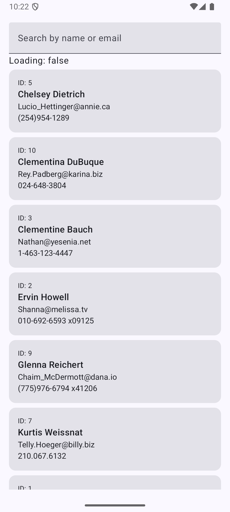

# User Directory App

## App Overview

A simple Android application that fetches and displays a list of users from JSONPlaceholder API. The app stores user data locally using Room Database, enabling offline access and fast search functionality. Users can search by name or email, and the app follows an offline-first architecture pattern for optimal user experience.

## Screenshots

| User List | Search Functionality |
|-----------|---------------------|
|  |  |

## Core Implementation

**API & Database:** The app uses Retrofit to fetch users from the JSONPlaceholder API and stores them in Room Database using @Insert(onConflict = REPLACE), making the database the single source of truth that the UI observes through Flow for automatic updates.

**Offline-First & Search:** On app launch, cached data from Room displays immediately while fresh data is fetched in the background; search queries execute locally in Room using SQL LIKE operators on name and email fields, requiring no API calls.
